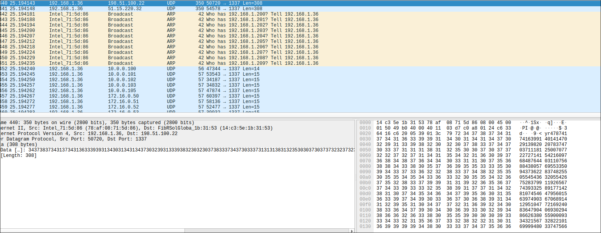

# SizeDoesMatter

- We are given a binary , a packet capture and 

```c
pBVar2 = BN_new();
a = BN_new();
BN_set_word(a,3);
iVar1 = BN_num_bits(r);
if (iVar1 < 0) {
    iVar1 = iVar1 + 3;
}
BN_rshift(pBVar2,r,iVar1 >> 2);  // N^0.25 (fourth root of N)
BN_div(pBVar2,(BIGNUM *)0x0,pBVar2,a,ctx);  // d = (N^0.25) / 3
```
- This is a hint that d is small:
- ``BN_rshift(pBVar2, r, iVar1 >> 2);`` computes N^0.25, meaning d is way too small.
- ``BN_div(pBVar2, (BIGNUM *)0x0, pBVar2, a, ctx);`` divides by 3, making d even smaller.
- We can see that the value of the d generated is small, specifically has the constraint ``<(N^0.25)/3`` , its vulnerable to [wieners attack](https://cryptohack.gitbook.io/cryptobook/untitled/low-private-component-attacks/wieners-attack) on rsa

- To Get the values from pcap file , open the given pcap file with wireshark for analysis:

    - we get N  
     

    - we get e 
      
    - we get c 
     


find the server addresses from the pcap file and get the values from them keep in below script:

```python
#!/usr/bin/env python3
import owiener
from Crypto.Util.number import long_to_bytes

#--------Data--------#
N = 77479246401894205068886348717755679757625021871831123071777695859921333068162038342336500655426026444039268284249125825890254011888318422295470198903414280509781067046211847789736437062552482362166205659492170258580352747048871852953661335133924658889156288620361043704880227984116253411200216248185395953337
e = 47874174163991401414702913982020783747037111812500707722727141542160976848764403110756884380576955335094373622837482550554543632055426752837991192656774393325891771428107454647956015639749036706891412951047721692408364790406930294866263805590009334321567328221016999948033747566405468898843661439914409606809
c = 30540923325491170931670320696700424722887386431472787243087186910007305052416716914590558572182229229766453084782356629283693134880309684833601948321368220632894961665922462749959371916041252363740072871988800959117309806520024815510094663225824703154902232651978160124383043281168991030852765264084602476003
#--------Wiener's attack--------#

d = owiener.attack(e, N)
if d:
    m = pow(c, d, N)
    flag = long_to_bytes(m).decode()
    print(flag)
else:
    print("Wiener's Attack failed.")
```
Running the above script , we get the 

```bash
$ python3 solve.py
p_ctf{S!z3_d0e5_m@tt3r_f0r_wi3n3Rs}
```
