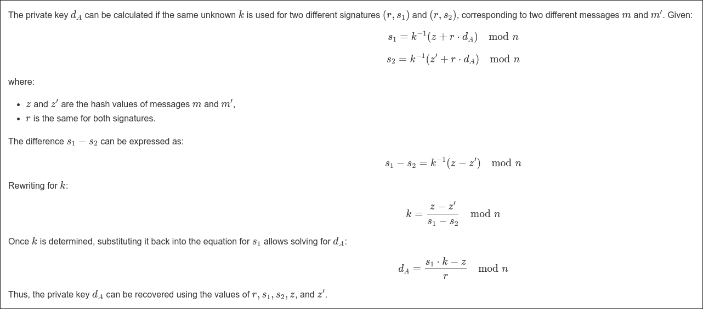

# sECCuritymaxxing

- By analyzing the code, it seems like there are several redundant functions and variables. Removing these unused functions would make it easier to identify the vulnerability in the signing process.

- The challenge's connection to ECC can be inferred from its name: sECCuritymaxxing.

- After removing all the redundant functions and renaming variables for clarity, the code becomes much easier to understand and analyze.

    - **f1:** Function seems like the elliptic curve point addition from the equations used in the function definition.
    - **f6:** This function defines a list of random values. Initially, it generates a list with 50 elements. If the extend method is called on this list three times, the total number of elements increases to 200.
    - **f9:** This doesn't seems to be related ECC , we assume its one  of the redundant functions that just finds the hash of some point.
    - **f2:** This function just checks if the point generated is on the elliptic curve.
    - **f7:** It is some sort of list that the signing function uses .
    - **f3:** This seems like the double and add method to find a certain point in the curve from the generator point and the random point.
    - **menu and main function:** This simulates the interface with the server.
    - **obtaining flag:** We can notice that the signature is not generated if the input message is "give_me_signature".

    So after removing all the redundant functions and renaming the variables , we get :

    ```python
    import random
    import hashlib
    import os

    # Curve parameters
    a, b = 0, 7
    G = (55066263022277343669578718895168534326250603453777594175500187360389116729240,
        32670510020758816978083085130507043184471273380659243275938904335757337482424)
    p = pow(2, 256) - pow(2, 32) - pow(2, 9) - pow(2, 8) - pow(2, 7) - pow(2, 6) - pow(2, 4) - 1
    n = 115792089237316195423570985008687907852837564279074904382605163141518161494337

    # Elliptic curve point addition
    def add_points(P, Q, p):
        x1, y1 = P
        x2, y2 = Q
        if x1 == x2 and y1 == y2:
            beta = (3 * x1**2 + a) * pow(2 * y1, -1, p)
        else:
            beta = (y2 - y1) * pow(x2 - x1, -1, p)
        x3 = (beta**2 - x1 - x2) % p
        y3 = (beta * (x1 - x3) - y1) % p
        return x3, y3

    # Point multiplication using double-and-add method
    def point_multiply(G, k, p):
        result = G
        k_bin = bin(k)[2:]
        for bit in k_bin[1:]:
            result = add_points(result, result, p)
            if bit == '1':
                result = add_points(result, G, p)
        return result

    # Signing a message
    def sign_message(private_key, message, k):
        hash_val = int(hashlib.sha1(message.encode()).hexdigest(), 16)
        point = point_multiply(G, k, p)
        r = point[0] % n
        s = ((hash_val + r * private_key) * pow(k, -1, n)) % n
        return hex(r), hex(s)

    # Verifying a signature
    def verify_signature(public_key, message, r, s):
        hash_val = int(hashlib.sha1(message.encode()).hexdigest(), 16)
        w = pow(s, -1, n)
        u1 = point_multiply(G, (hash_val * w) % n, p)
        u2 = point_multiply(public_key, (r * w) % n, p)
        result_point = add_points(u1, u2, p)
        return result_point[0] % n == r

    # Menu-driven application
    def menu():
        print("1. Sign a message")
        print("2. Verify a signature")
        return int(input("Choose an option: "))

    def main():
        private_key = random.getrandbits(256)
        public_key = point_multiply(G, private_key, p)
        k_values = [random.getrandbits(256) for _ in range(100)]
        random.shuffle(k_values)
        k_index = 0

        while True:
            choice = menu()
            if choice == 1:
                message = input("Enter the message to sign: ")
                k = k_values[k_index]
                r, s = sign_message(private_key, message, k)
                print(f"Signature (r, s): {r}, {s}")
                k_index = (k_index + 1) % len(k_values)
            elif choice == 2:
                message = input("Enter the message to verify: ")
                r = int(input("Enter r (in hex): "), 16)
                s = int(input("Enter s (in hex): "), 16)
                if verify_signature(public_key, message, r, s):
                    print("Signature is valid.")
                else:
                    print("Signature is invalid.")
            else:
                print("Invalid option. Try again.")

    if __name__ == "__main__":
        main()

    ```

- The challenge seems to be inspired from the [**PS3** exploit](https://deeprnd.medium.com/decoding-the-playstation-3-hack-unraveling-the-ecdsa-random-generator-flaw-e9074a51b831) , but here instead of a single value to sign messages , it seems to  use a list of random numbers to do the same , so we should by theory get the same random number signing messages for every 200 messages, here the first message and the 201st message is signed by the same random number(k).

- Once we obtain the values of (r,s1) and (r,s2) we can do this:



- So we can write a script that will interact with the remote server and store all the responses(ie signatures) from the server and then calculates the private key and then the signature of the text that gives us the flag.

```python
from pwn import remote 
import hashlib
from hashlib import sha1

j=200 #value of j shud be (1+val in range)? number of interactions

def inverse_mod(a, m):
    if m <= 0:
        raise ValueError("Modulus must be positive")

    a = a % m
    
    def extended_gcd(a, b):
        if a == 0:
            return b, 0, 1
        gcd, x1, y1 = extended_gcd(b % a, a)
        x = y1 - (b // a) * x1
        y = x1
        return gcd, x, y

    gcd, x, _ = extended_gcd(a, m)
    
    if gcd != 1:
        raise ValueError(f"Modular inverse does not exist for {a} (mod {m})")
    
    return x % m

host='seccmaxx.ctf.prgy.in' #Replace with the actual server's addres
port=1337 #Replace with the actual port number
conn=remote(host,port,ssl=True)

conn.recvuntil(b">")
conn.sendline(b"1")
conn.recvuntil(b">")
conn.sendline(b"0")
x = eval(conn.recvline().decode().strip())
r = int(x[0], 16)
s1 = int(x[1], 16)

print("loop")
for i in range(1,j):
    conn.recvuntil(b">")
    conn.sendline(b"1")
    conn.recvuntil(b">")
    conn.sendline(f"{i}".encode())
    conn.recvline()

conn.recvuntil(b">")
conn.sendline(b"1")
conn.recvuntil(b">")
conn.sendline(b"200")
x = eval(conn.recvline().decode().strip())
s2 = int(x[1], 16)

a, b  = 0, 7 
G = (55066263022277343669578718895168534326250603453777594175500187360389116729240,
     32670510020758816978083085130507043184471273380659243275938904335757337482424)
p = pow(2, 256) - pow(2, 32) - pow(2, 9) - pow(2, 8) - pow(2, 7) - pow(2, 6) - pow(2, 4) - pow(2, 0)
n = 115792089237316195423570985008687907852837564279074904382605163141518161494337

m1=str(0)
m2=str(200)

z1 = int(sha1(m1.encode()).hexdigest(), 16)
z2 = int(sha1(m2.encode()).hexdigest(), 16)

k_0=int((((z1-z2) % n)*inverse_mod(s1-s2,n))%n)
d=int(((((s1*k_0)%n)-z1)*inverse_mod(r,n))%n)
print(f"k_0:{k_0}")
print(f"d:{d}")


def add_points(P, Q, p):
    x1, y1 = P
    x2, y2 = Q
    if x1 == x2 and y1 == y2:
        beta = (3 * x1 * x2 + a) * pow((2 * y1), -1, p)
    else:
        beta = (y2 - y1) * pow((x2 - x1), -1, p)
    x3 = (pow(beta, 2) - x1 - x2) % p
    y3 = (beta * (x1 - x3) - y1) % p
    return x3, y3

def is_on_curve(P, p):
    x, y = P
    assert (y * y) % p == (pow(x, 3, p) + a * x + b) % p

is_on_curve(G, p)

def apply_double_and_add_method(G, k, p):
    target_point = G
    k_binary = bin(k)[2:]
    for i in range(1, len(k_binary)):
        current_bit = k_binary[i]
        target_point = add_points(target_point, target_point, p)
        if current_bit == '1':
            target_point = add_points(target_point, G, p)
    is_on_curve(target_point, p)
    return target_point
Q = apply_double_and_add_method(G=G, k=d, p=p)

random_point=apply_double_and_add_method(G=G, k=k_0, p=p)

r_e=(random_point[0])%n 
rh=hex(r_e)
message="give_me_signature"

hash_int = int(hashlib.sha1(message.encode()).hexdigest(),16)
s_e= int(((hash_int + r * d) * pow(k_0,-1, n)) % n)
sh=hex(s_e)

print(r_e,s_e)

conn.recvuntil(b">")
conn.sendline(b"2")
conn.recvuntil(b"r:")
conn.sendline(f"{r_e}".encode())
conn.recvuntil(b"s:")
conn.sendline(f"{s_e}".encode())
print(conn.recvline().decode().strip())
```

- This will output the flag when run , like

```bash
[+] Opening connection to seccmaxx.ctf.prgy.in on port 1337: Done
loop
k_0:717763941780183118526530982790522858243178943429260722922420559033064098666
d:12984085677200567120025541160626933671102186318375640817200001093806261430104
49442086066263765872612330358881459288101239965427804702051767507896016250058 51260143935973258174511406091082379391286362599591220652635480018025470806600
p_ctf{I5it_tH3K3Y_0r_y0|_|r_pr!5ef0R_fr3340m}
[*] Closed connection to seccmaxx.ctf.prgy.in port 1337
```
